# UESOC
<!-- TOC -->

- [UESOC](#uesoc)
    - [一、概述](#一概述)
        - [为什么要软光栅剔除？](#为什么要软光栅剔除)
        - [1. Demo的环境和运行结果](#1-demo的环境和运行结果)
        - [2. 代码流程图](#2-代码流程图)
        - [3. 类图](#3-类图)
    - [二、关键点](#二关键点)
        - [1.输入数据](#1输入数据)
            - [相机信息](#相机信息)
            - [物件信息](#物件信息)
        - [2.处理输入数据](#2处理输入数据)
        - [3.几何阶段](#3几何阶段)
            - [occluder](#occluder)
            - [occludee](#occludee)
        - [4.光栅化阶段](#4光栅化阶段)
            - [Occluder](#occluder)
            - [Occludee](#occludee)
        - [5.两个buffer交替](#5两个buffer交替)
        - [6. SIMD优化](#6-simd优化)

<!-- /TOC -->
## 一、概述

剔除在游戏引擎里面很常见，就是将一些摄像机看不到的东西剔除掉，减少性能的消耗。
常见的剔除有距离剔除（[UE demo](https://github.com/wlxklyh/awesome-gamedev/tree/main/demo/Unreal/CullDistance)）、视锥剔除、Hardware occlusion culling、potentially visible set、Hiz occlusion culling、software occlusion culling。
这些UE都有，本文是讲SOC，我把UE的SOC部分抽离成一个工程，这样可以比较方便的调试和阅读。

通过下面两个图对剔除有个认知：  
下面是视锥剔除，不在视锥范围内不渲染  
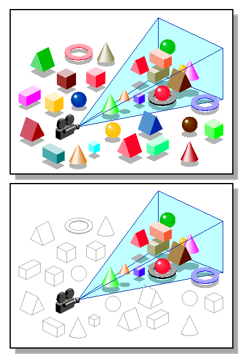

下面包括视锥剔除 遮挡剔除  
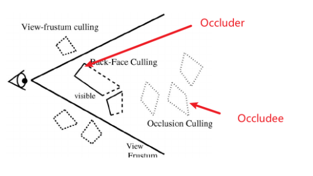

### 为什么要软光栅剔除？
|剔除方法|简述|缺点|
|-|-|-|
|距离剔除|设定一个阀值 如果物件距离相机的距离超出这个阀值则剔除|远处的物件被剔除看不到了 很粗糙的剔除|
|视锥剔除|将物件的包围盒做一个坐标变换 变换到裁剪坐标系 然后如果不在视锥范围 则剔除|在视锥范围内 但是被遮挡了 这种剔除不了|
|potentially visible set|对场景分格 预先计算好每个格子的可见集 游戏runtime的时候 查下PVS的数据结构 不可见的就不渲染|预先计算的 所以不能剔除动态物件|
|Hardware occlusion culling|通过DX Opengl的遮挡查询接口 查询物件是否被遮挡|CPU GPU之间的查询 比较久 需要等待 也给GPU带来额外的压力|
|Hiz occlusion culling|通过上一帧的深度buffer 生成hiz 通过hiz 来查询到遮挡情况||
|software occlusion culling|在CPU走一遍简单的光栅化来 得到哪些物件要被剔除|CPU 消耗|

软光栅是一种可以剔除动态物件的runtime方法。

### 1. Demo的环境和运行结果
要安装这个 https://easyx.cn/ 用了easyx来做UI显示。
下面是demo运行后的结果，将屏幕水平分割成6个桶，有一个正方形遮挡物显示在了第四个桶上面。先有个大致的了解。
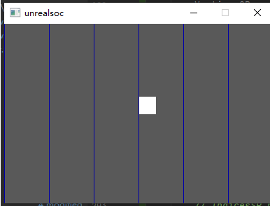

### 2. 代码流程图
下面是代码流程图（矢量图可以放大来看），如果可以看懂就不用往下面看了，后面会把一些关键点拿出来讲解。

### 3. 类图
下面是类图，这里分了4个部分：输入的数据、输入的数据处理成SOC需要的数据、几何阶段之后形成三角形数据、输出数据（光栅化结果和可见集） 这部分可以稍微看下，下面讲到具体的内容再来查阅。
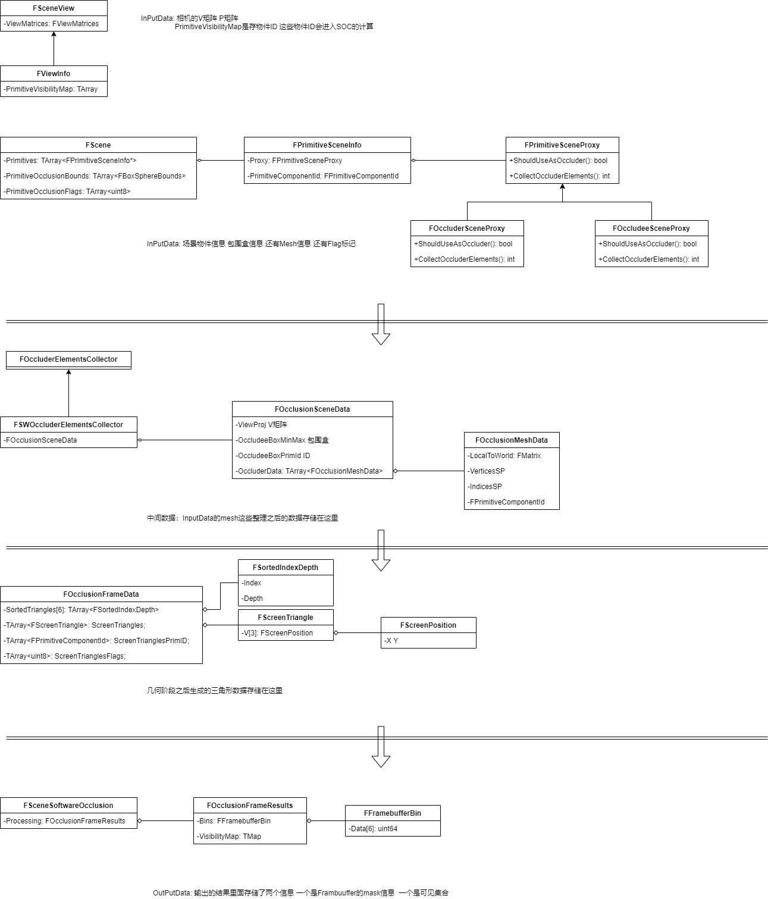

## 二、关键点
### 1.输入数据
输入数据分成两部分：相机信息、场景物件信息。

#### 相机信息

FViewMatrices里面存储了 View矩阵 和 投影矩阵。  几何阶段通过物件本身的Model矩阵和这里的View矩阵、投影矩阵就可以得到裁剪坐标系的三角形信息。

#### 物件信息

FScene里面存储了三个数组 Primitives PrimitiveOcclusionBouds PrimitiveOcclusionFlags,分别是物件、物件包围盒、物件标记。物件里面有物件ID和物件代理，物件代理分成了Occluder(遮挡物)和Occludee（被遮挡物）。
基类里面有两个函数，ShouldUseAsOccluder是判断是否是遮挡物，遮挡物和被遮挡物走的是不同的流程。CollectOccluderElements是拿来收集遮挡物的mesh信息的。

### 2.处理输入数据

遍历输入数据里面的PrimitiveProxy 的时候 会用FSWOccluderElementsCollector来收集mesh数据。
每个Mesh的数据有LocalToWorld 就是model矩阵 VerticesSP就是顶点数据 Indices是索引数据。

### 3.几何阶段
几何阶段会形成三角形 因为屏幕空间会分层6个桶，所以一个三角形如果跨越了两个桶，就会存储在两个桶里面。
#### occluder
遮挡物的几何阶段，会遍历occluder的mesh 每个三角形通过有MVP 还有一个屏幕buffer转换矩阵 去得到屏幕空间的三角形，遮挡物的三角形的Depth是存储最远的，被遮挡物是存储最近的。

#### occludee
被遮挡物的几何阶段，被遮挡物太多了 这里做了优化 处理的是被遮挡物的包围盒，那么就是8个顶点，投影到屏幕空间之后 再用一个屏幕空间的矩形包围盒包着，那么就会得到两个三角形。
这两个三角形只存储一个三角形就可以，因为可以推断出另外一个三角形，注意这里生成的三角形存储的深度是世界空间包围盒的最近的depth,这样计算的可见集才是正确的。

### 4.光栅化阶段
经过几何阶段之后得到了一系列的三角形，这些三角形是分桶的，当然跨越了就会存在多个桶里面。例如下图红色的这个三角形就跨越了三个桶 这三个通过都存储了这个三角形。
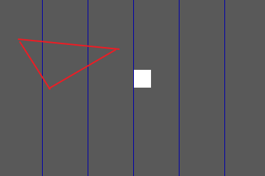
首先要进行三角形的深度的排序，有点early-Z的味道。
然后按照顺序光栅化：
#### Occluder
如果是Occluder的三角形，那么就需要写数据到Framebuffer里面，会将三角形拆分成两部分 上下两部分来做扫描线的光栅化。
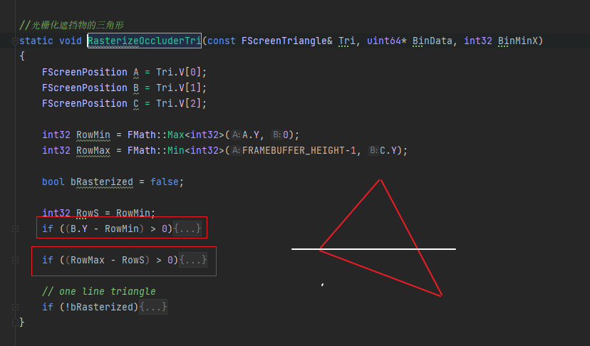

每一行是64bit,所以这里可以用位运算来做光栅化的写入。例如下图白色横线就是一个int64
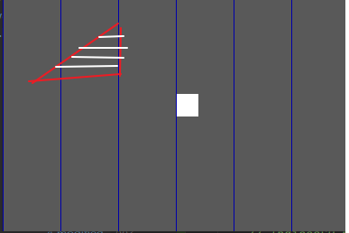
下面是根据x0 x1坐标去得到这个64bit mask的代码:
如果x1-x0等于64那么就是 1111111...这样的mask。
不然则是将1左移num个-1， 再左移x0个 这里很巧妙 可以自己用一个数据试下
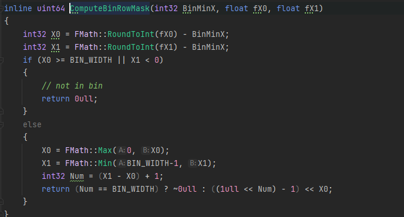

#### Occludee
Occludee的三角形只会做遮挡查询 不会写入mask,因为Occludee都是屏幕矩形 所以不会拆两部分 直接遍历这个三角形的Y 然后做mask检查
如果有重叠说明 是可见的 然后就会认为这个物件是可见的，因为是排序后的光栅化，所以当前光栅化的三角形的z一定小于mask的z。如果被遮挡了肯定深度也小于mask上面的z。
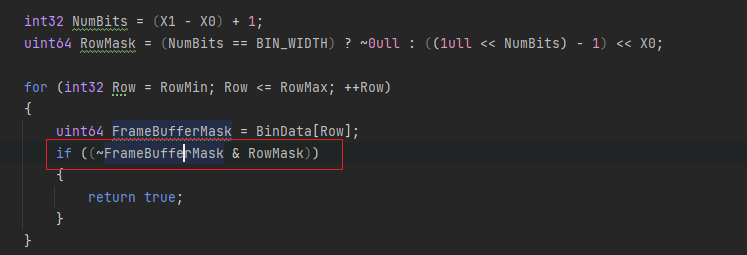

### 5.两个buffer交替 
Avaiable是之前处理好的 会应用在当前帧 当前帧的Processing交给线程去处理
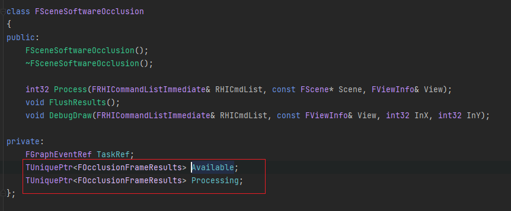
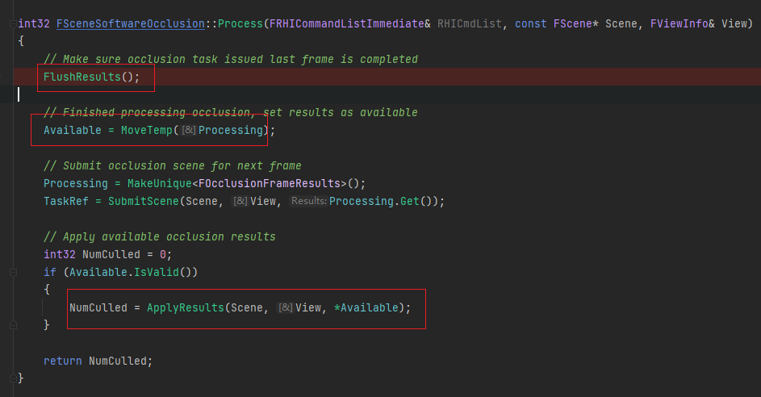

### 6. SIMD优化
例如在将mesh的顶点做转换到裁剪空间的时候 用了SIMD 这里也比较合理 瓶颈是Mesh的顶点 顶点是4个float 很好做SIMD。
下面是SIMD优化的地方：
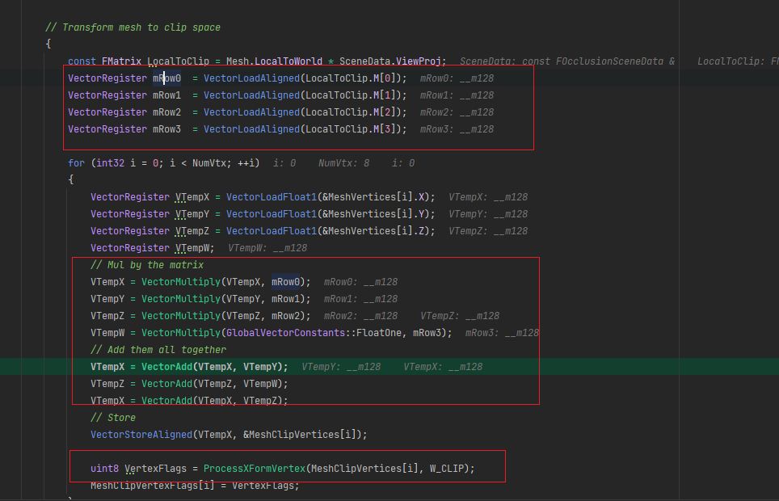
最终调用到这里，四个float打包成__mm_128 然后做加法：

